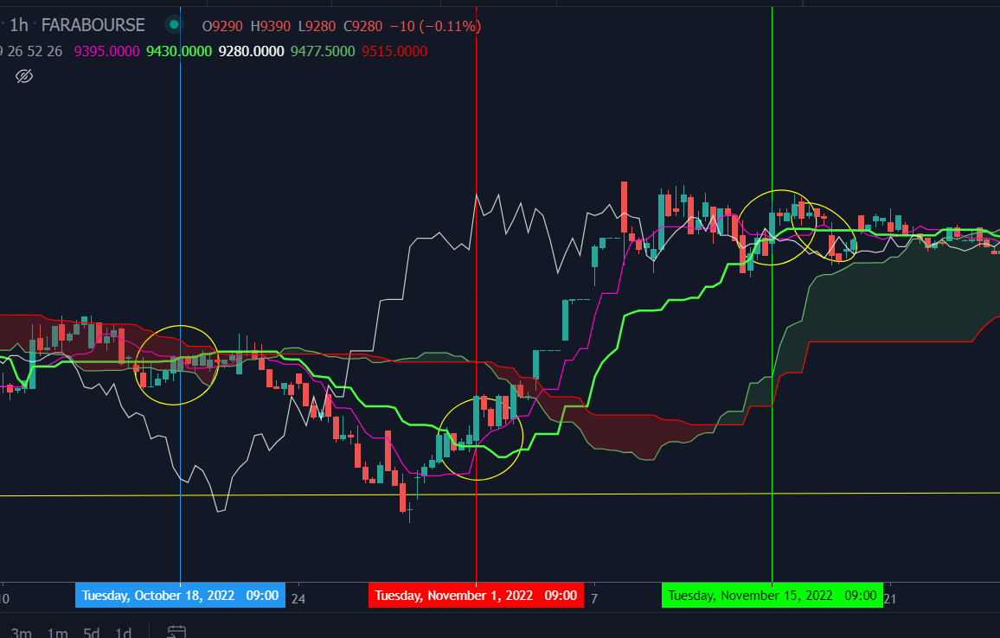

## [](https://github.com/Qasemt/Ichimoku/actions/workflows/go.yml)

# Ichimoku

ichimoku indicator

## Source

- [Intersection Point Of Two Lines][1]

## Calculation

```

There are five plots that make up the Ichimoku Cloud indicator. Their names and calculations are:

TenkanSen (Conversion Line): (High + Low) / 2 default period = 9
KijunSen (Base Line): (High + Low) / 2 default period = 26
Chiku Span (Lagging Span): Price Close shifted back 26 bars
Senkou A (Leading Span A): (TenkanSen + KijunSen) / 2 (Senkou A is shifted forward 26 bars)
Senkou B (Leading Span B): (High + Low) / 2 using period = 52 (Senkou B is shifted forward 26 bars)
```

---



Result :

```console

calc ichi from Last 100 days

 Find ichi 8630|8630|8630|8715|8450|G:false,Chiko UP :true |status : cross below |cloud switching : false|leaving cloud : false |2022 Tue Oct 11 10:00:00 |1665469800000
____
 Find ichi 8685|8690|8687.5|8710|8500|G:false,Chiko UP :true |status : cross inside |cloud switching : false|leaving cloud : false |2022 Tue Oct 18 10:00:00 |1666074600000
____
 Find ichi 8135|8135|8135|8300|8520|G:false,Chiko UP :false |status : cross below |cloud switching : false|leaving cloud : false |2022 Tue Nov 1 10:00:00 |1667284200000
____
 Find ichi 9485|9525|9505|8790|9490|G:true,Chiko UP :true |status : cross above |cloud switching : false|leaving cloud : false |2022 Tue Nov 15 11:00:00 |1668497400000
____
 Find ichi 9570|9545|9557.5|8960|9410|G:true,Chiko UP :true |status : cross above |cloud switching : false|leaving cloud : false |2022 Wed Nov 16 12:00:00 |1668587400000

```

[1]: https://web.archive.org/web/20060911055655/http://local.wasp.uwa.edu.au/~pbourke/geometry/lineline2d/
